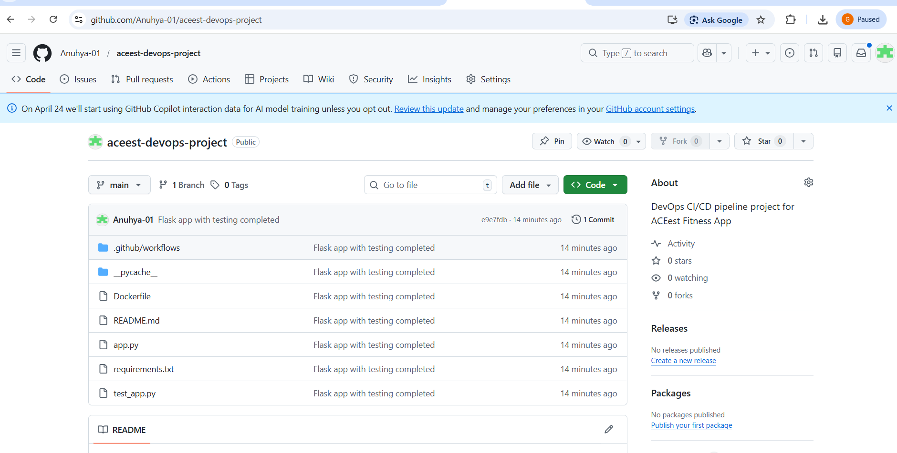
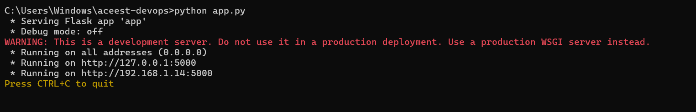
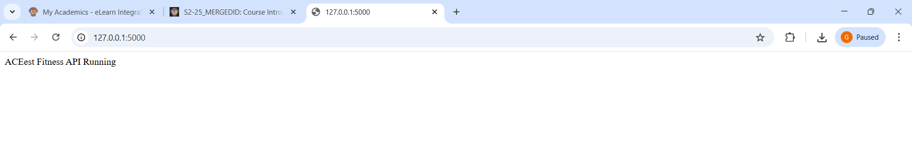
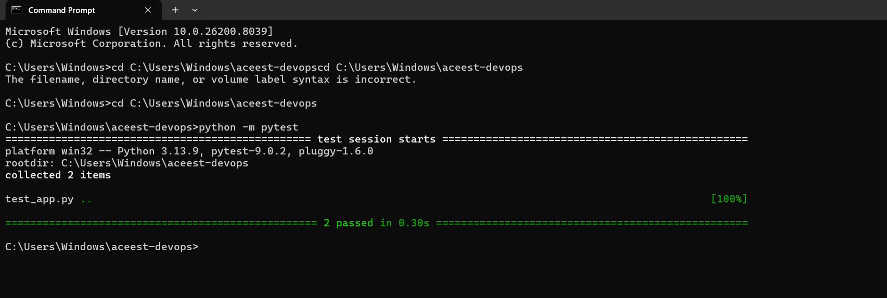
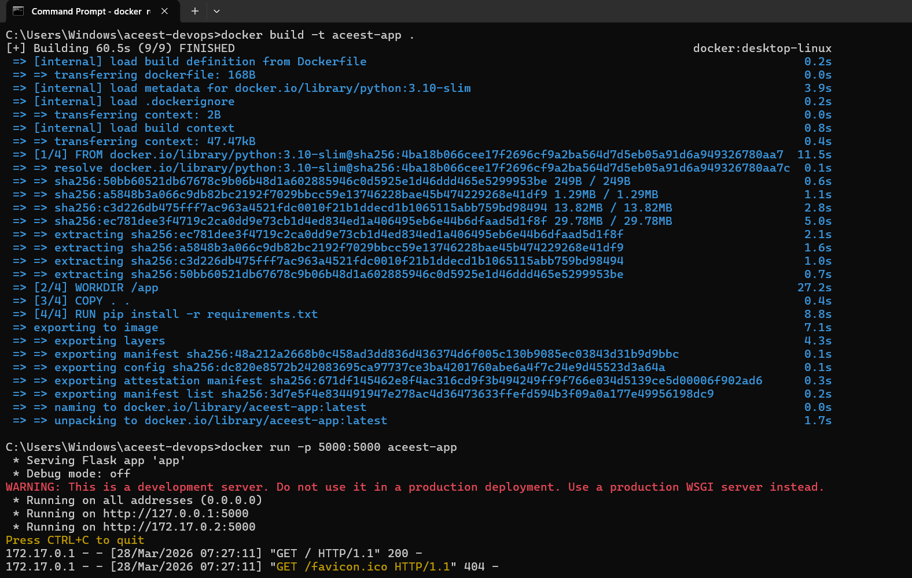
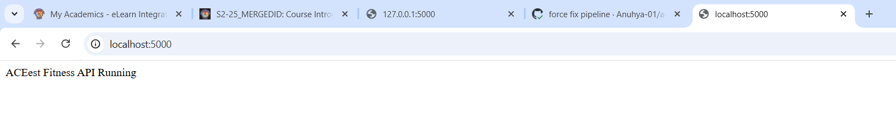
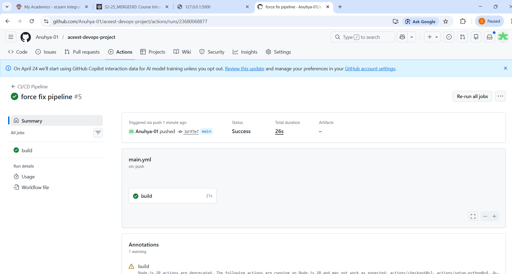
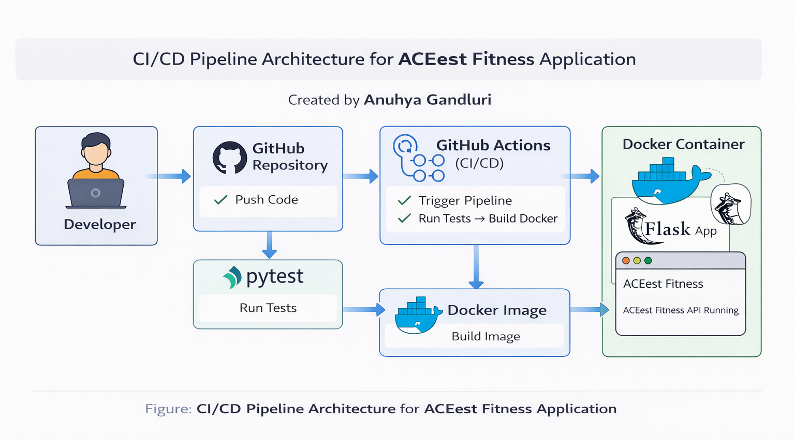

# ACEest Fitness & Gym – CI/CD DevOps Project

## 1. Project Overview

This project demonstrates a complete CI/CD pipeline using Flask, GitHub Actions, Docker, and Pytest.

The pipeline automates:
- Code integration  
- Testing  
- Docker image creation  

This ensures faster, reliable, and consistent application delivery.

---

## 2. Tools & Technologies Used

The following tools and technologies were used in this project:
- **Python** → Backend programming  
- **Flask** → Web framework  
- **GitHub** → Version control  
- **Pytest** → Testing framework  
- **Docker** → Containerization  
- **GitHub Actions** → CI/CD automation  
- **Jenkins** → Build tool (conceptual)

---

## 3. Project Structure
aceest-devops/

│

├── app.py                   # Flask application

├── test_app.py             # Pytest test cases

├── requirements.txt        # Dependencies

├── Dockerfile              # Container configuration

├── README.md               # Documentation

└── .github/

    └── workflows/
    
        └── main.yml        # CI/CD pipeline
        

---

## 4. Run Application Locally

Follow these steps to run the application on your local machine:
### Step 1: Install dependencies
pip install -r requirements.txt
### Step 2: Run the application
python app.py
### Step 3: Open in browser
http://127.0.0.1:5000  

The following screenshots shows the Installation & Flask application running successfully in the browser: 

---

## 5. Run Tests

Execute the following command to run test cases:

python -m pytest

### Expected Output:
`2 passed`

## 5.1 Test Output

The following screenshot shows successful execution of test cases:

---

## 6. Docker Setup
Docker is used to containerize the application for consistent deployment across environments.
### 6.1 Build Docker Image
docker build -t aceest-app .
### 6.2 Run Docker Container
docker run -p 5000:5000 aceest-app

### 6.3 Access Application
http://localhost:5000

## 6.4 Docker Output

The following screenshot shows the application running inside a Docker container:

---
## 7. CI/CD Pipeline (GitHub Actions)

The CI/CD pipeline is implemented using GitHub Actions and is defined in:

.github/workflows/main.yml

### 7.1 Pipeline Workflow:

1. Code is pushed to GitHub repository  
2. GitHub Actions workflow is triggered automatically  
3. Dependencies are installed  
4. Test cases are executed using Pytest  
5. Docker image is built  

This automation ensures that the application is always tested and ready for deployment.

---

## 7.2 CI/CD Pipeline Result

The following screenshot shows successful execution of the CI/CD pipeline:

---

## 8. Architecture Diagram

The architecture of the system follows a CI/CD pipeline approach:
Developer → GitHub → GitHub Actions → Pytest → Docker → Application Deployment

This improves:
- Development speed  
- Code quality  
- Deployment reliability
  

---

## 9. Jenkins Integration

Jenkins is a build automation tool used for continuous integration.

In this project:
- GitHub Actions is used as the primary CI/CD tool  
- Jenkins is considered as an additional validation tool  

### Jenkins Workflow:
- Pull code from GitHub  
- Execute build and tests  
- Validate application  

---

## 10. Conclusion

This project demonstrates a complete DevOps pipeline that automates:
- Code integration  
- Testing  
- Containerization  

This improves efficiency, reliability, and deployment speed.

